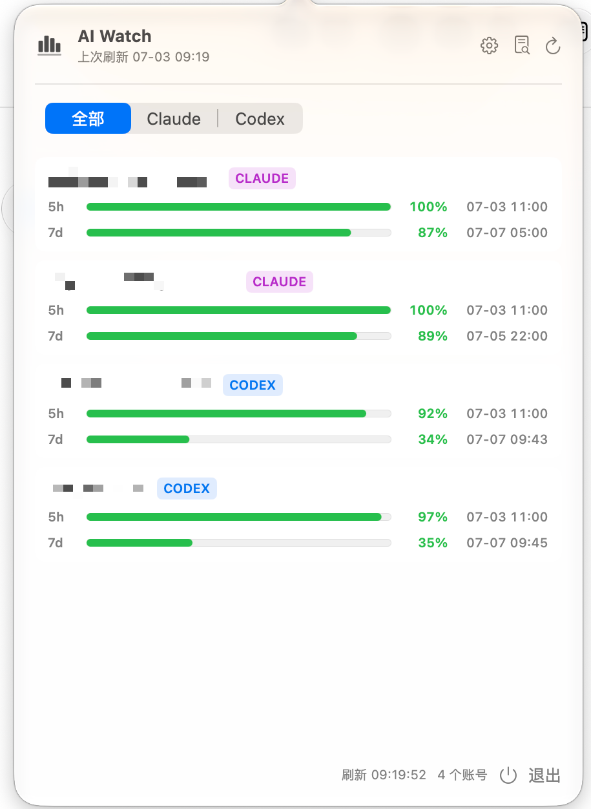

# AI Watch


一个安静待在 macOS 菜单栏里的 AI 额度监控小工具。点一下顶部图标，就能看到 Claude / Codex 账号的 5 小时窗口、7 天窗口、剩余额度和重置时间。



## 功能

- macOS 原生菜单栏应用，轻量不打扰。
- 支持 Claude 与 Codex 账号额度展示。
- 显示剩余额度进度条、百分比和重置时间。
- 可隐藏禁用账号。
- 配置与诊断日志独立窗口。
- 读取 CLIProxyAPI Management API，不主动修改账号状态。

## 配置

启动后点击菜单栏图标，再点齿轮按钮：

- `Base URL`：你的 CLIProxyAPI Management API 地址，例如 `https://your-domain.example.com`
- `Token`：CLIProxyAPI 的 Management Key，不需要带 `Bearer`
- `刷新间隔`：默认 5 分钟

## 构建

项目使用较新的 Xcode 工程格式，请使用 Xcode beta：

```bash
DEVELOPER_DIR=/Applications/Xcode-beta.app/Contents/Developer \
xcodebuild -project ai-watch.xcodeproj \
  -scheme ai-watch \
  -configuration Release \
  -derivedDataPath build/DerivedData \
  clean build
```

构建产物位于：

```text
build/DerivedData/Build/Products/Release/ai-watch.app
```

## 说明

AI Watch 只做额度观察：读取账号列表和 usage 信息，不执行刷新额度的 `hello` 请求，也不会临时启停账号。它适合放在屏幕角落，像一个小仪表一样提醒你什么时候该歇一歇，什么时候又能继续开工。
